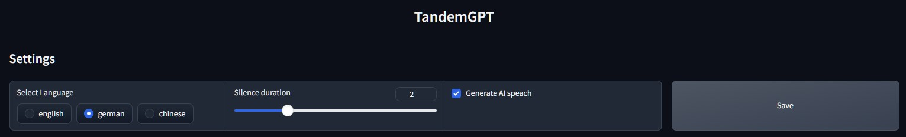
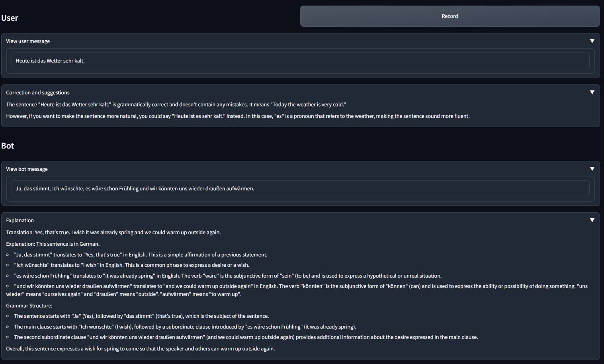
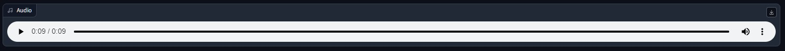

# Tandan Partner Chatbot

TandanGPT is a chatbot which allows you to engage in conversations by speaking into the microphone. Alonge with the AI chat response, it generates corrections and suggestions for your sentences. Additionally, the AI explains it's own response to help you understand and learn.

## DEMO

Set the language you wish to practice

Choose to view or hide sections

Play the generated AI audio

An demo of AI speech
[Audio Demo](AI_speech.wav)

## Settings
- Select the language which you would like to practice.
- Set the silience duration (the amount of time of not speaking until it automatically stops recording)

## Technologies Used

- **Automatic Speech Recognition**: OpenAI's Whisper-medium model for speech recognition, running locally.
- **Chat Generation**: OpenAI's GPT-3.5 Turbo model used for generating chat responses.
- **Text to Speech**: Bark-Small model for text-to-speech functionality, running locally.
- **UI Interface**: Gradio for creating the user interface.

## How it Works

1. **Automatic Speech Recognition (ASR)**:
   - You speak into the microphone, and the application uses OpenAI's Whisper/Medium model to transcribe your speech.

2. **Chat Generation**:
   - The transcribed speech is sent to OpenAI's GPT-3.5 Turbo model, which generates a response based on the input.

3. **Text to Speech (TTS)**:
   - The AI-generated response is converted to speech using the Bark-Small model, providing an audible response.

4. **User Interface**:
   - The UI interface, created using Gradio, allows you to interact with the chatbot and receive the AI-generated responses.

## Getting Started

TODO

## Future Features and Improvments

TODO

## Contributing

We welcome contributions! If you'd like to contribute to this project, please follow these guidelines:

1. Fork the repository and create your branch: `git checkout -b feature/your-feature`.
2. Commit your changes: `git commit -m 'Add your feature'`.
3. Push to the branch: `git push origin feature/your-feature`.
4. Submit a pull request.

## License

This project is licensed under the [MIT License](LICENSE). Feel free to use, modify, and distribute this code for your purposes.
